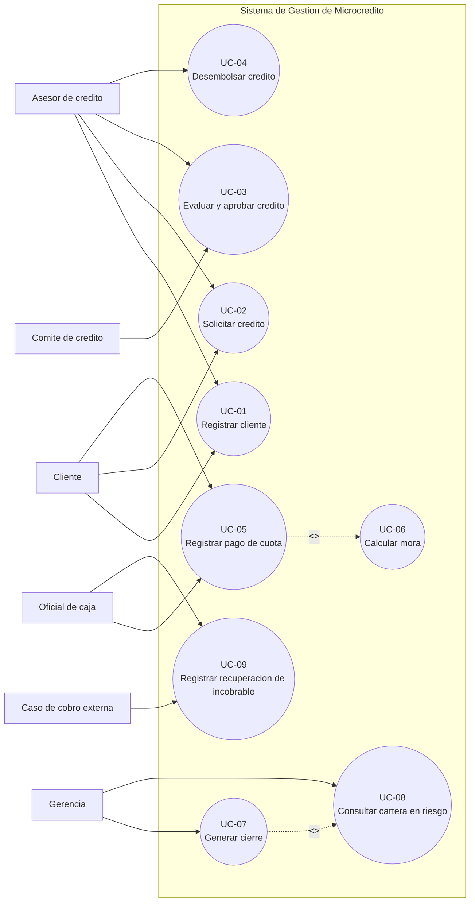

# Casos de uso del sistema

## Alcance

`UC-06` y `UC-08` son calculos del nucleo actual. Los casos de uso de originacion, cierre, persistencia y recuperacion son contratos del dominio futuro y no implican que exista un servidor o base de datos en E4.
