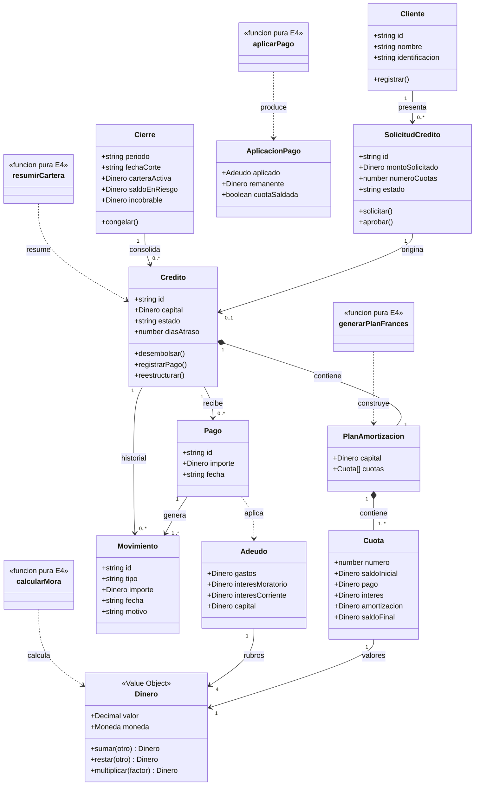

# Modelo de dominio

El modelo distingue entidades del negocio de los servicios puros ya implementados en `src/dominio`.

## Reglas representadas

- `Dinero` es inmutable, usa `decimal.js`, redondea a dos decimales y valida moneda.
- `generarPlanFrances` ajusta la ultima amortizacion para dejar saldo cero.
- `calcularMora` usa exclusivamente capital en mora y una base de dias parametrizable.
- `aplicarPago` aplica gastos, moratorio, corriente y capital, en ese orden.
- `resumirCartera` excluye incobrables de cartera activa y conserva reestructurados como riesgo.
