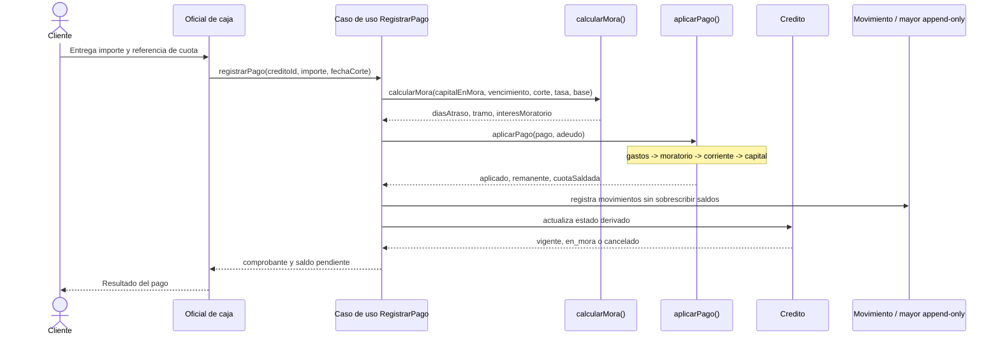
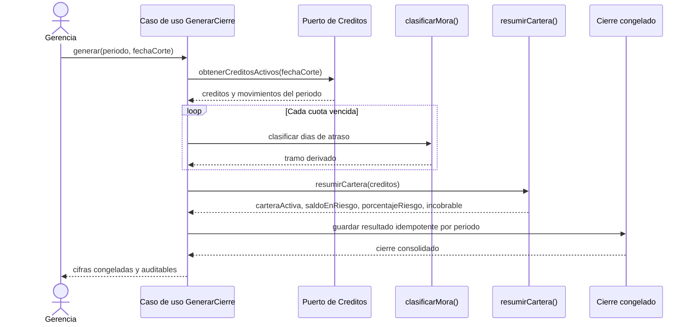

# Secuencias principales

## Registrar pago de cuota

```mermaid
sequenceDiagram
    actor Cliente
    participant Caja as Oficial de caja
    participant Pago as Caso de uso RegistrarPago
    participant Mora as calcularMora()
    participant Prelacion as aplicarPago()
    participant Credito
    participant Mayor as Movimiento / mayor append-only

    Cliente->>Caja: Entrega importe y referencia de cuota
    Caja->>Pago: registrarPago(creditoId, importe, fechaCorte)
    Pago->>Mora: calcularMora(capitalEnMora, vencimiento, corte, tasa, base)
    Mora-->>Pago: diasAtraso, tramo, interesMoratorio
    Pago->>Prelacion: aplicarPago(pago, adeudo)
    Note over Prelacion: gastos -> moratorio -> corriente -> capital
    Prelacion-->>Pago: aplicado, remanente, cuotaSaldada
    Pago->>Mayor: registra movimientos sin sobrescribir saldos
    Pago->>Credito: actualiza estado derivado
    Credito-->>Pago: vigente, en_mora o cancelado
    Pago-->>Caja: comprobante y saldo pendiente
    Caja-->>Cliente: Resultado del pago
```

## Generar cierre mensual

```mermaid
sequenceDiagram
    actor Gerente as Gerencia
    participant Cierre as Caso de uso GenerarCierre
    participant Repo as Puerto de Creditos
    participant Mora as clasificarMora()
    participant Cartera as resumirCartera()
    participant Congelador as Cierre congelado

    Gerente->>Cierre: generar(periodo, fechaCorte)
    Cierre->>Repo: obtenerCreditosActivos(fechaCorte)
    Repo-->>Cierre: creditos y movimientos del periodo
    loop Cada cuota vencida
        Cierre->>Mora: clasificar dias de atraso
        Mora-->>Cierre: tramo derivado
    end
    Cierre->>Cartera: resumirCartera(creditos)
    Cartera-->>Cierre: carteraActiva, saldoEnRiesgo, porcentajeRiesgo, incobrable
    Cierre->>Congelador: guardar resultado idempotente por periodo
    Congelador-->>Cierre: cierre consolidado
    Cierre-->>Gerente: cifras congeladas y auditables
```
