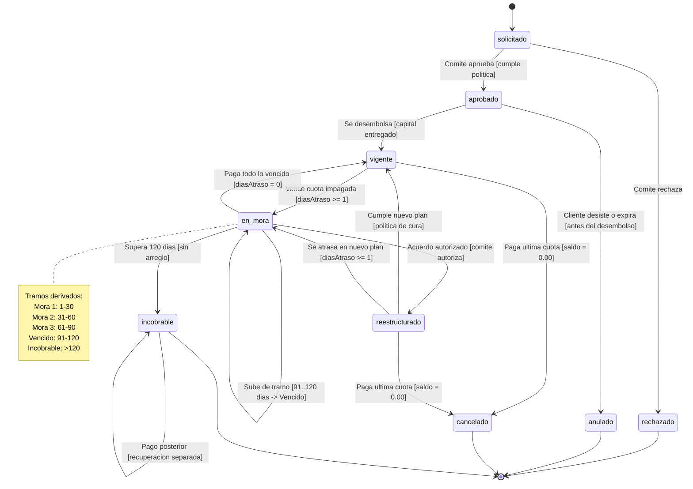

# Estados del credito

Los tramos de mora son una clasificacion derivada de `diasAtraso`, no estados. Las transiciones invalidas deben quedar protegidas por el patron State en la implementacion futura.

La transicion `incobrable --> incobrable` representa una recuperacion contable que no reactiva el credito ni lo devuelve a cartera.
