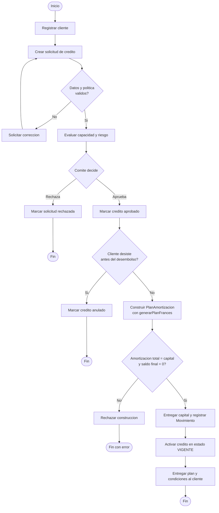

# Actividad de originacion y desembolso

```mermaid
flowchart TD
    inicio([Inicio]) --> registrar[Registrar cliente]
    registrar --> solicitud[Crear solicitud de credito]
    solicitud --> validar{Datos y politica<br/>validos?}
    validar -- No --> corregir[Solicitar correccion]
    corregir --> solicitud
    validar -- Si --> evaluar[Evaluar capacidad y riesgo]
    evaluar --> decision{Comite decide}
    decision -- Rechaza --> rechazado[Marcar solicitud rechazada]
    rechazado --> finRechazo([Fin])
    decision -- Aprueba --> aprobado[Marcar credito aprobado]
    aprobado --> desistir{Cliente desiste<br/>antes del desembolso?}
    desistir -- Si --> anulado[Marcar credito anulado]
    anulado --> finAnulado([Fin])
    desistir -- No --> plan[Construir PlanAmortizacion<br/>con generarPlanFrances]
    plan --> invariantes{Amortizacion total = capital<br/>y saldo final = 0?}
    invariantes -- No --> error[Rechazar construccion]
    error --> finError([Fin con error])
    invariantes -- Si --> desembolso[Entregar capital y registrar Movimiento]
    desembolso --> vigente[Activar credito en estado VIGENTE]
    vigente --> informar[Entregar plan y condiciones al cliente]
    informar --> finExito([Fin])
```
