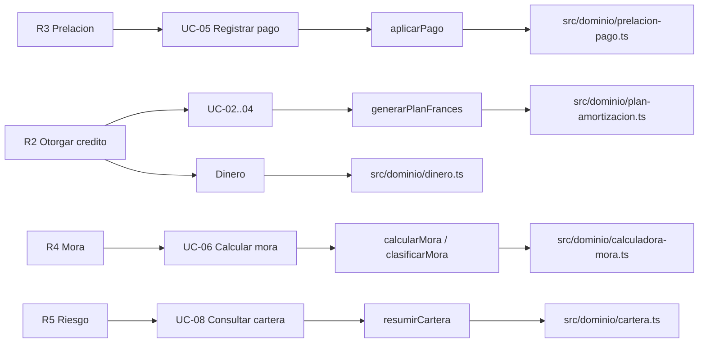

# Matriz de trazabilidad

| Requisito | Caso de uso | Clase o modulo | Evidencia actual |
| --- | --- | --- | --- |
| R1: Registrar y consultar clientes | UC-01 Registrar cliente | `Cliente` / Originacion | Modelo conceptual E1; aun no implementado en E4 |
| R2: Otorgar credito con plan de cuotas | UC-02 Solicitar credito, UC-03 Evaluar y aprobar, UC-04 Desembolsar | `SolicitudCredito`, `Credito`, `PlanAmortizacion`, `Cuota` | `generarPlanFrances()` y prueba del caso Q10,000 / 12 cuotas |
| R3: Registrar pagos aplicando prelacion | UC-05 Registrar pago de cuota | `Pago`, `Adeudo`, `AplicacionPago`, `aplicarPago()` | Pruebas de pago parcial Q500 y excedente Q3,000 |
| R4: Calcular mora e interes moratorio | UC-06 Calcular mora | `Mora`, `calcularMora()`, `clasificarMora()` | Prueba Q7.26 sobre Q725.76 de capital en mora |
| R5: Reportar cierres y cartera en riesgo | UC-07 Generar cierre, UC-08 Consultar cartera en riesgo | `Cierre`, `CreditoCartera`, `ResumenCartera`, `resumirCartera()` | Pruebas de 7.00% y 6.06%; cierre completo conceptual |
| R6: Mantener trazabilidad contable | UC-05, UC-07, UC-09 | `Movimiento`, `Cierre` | Modelo conceptual; persistencia y mayor append-only fuera de E4 |
| R7: Aplicar estados reversibles del credito | UC-03, UC-04, UC-05 | `Credito` + State | Diagrama de estados; entidad State aun no implementada en E4 |

## Nucleo ejecutable y archivos

Las filas conceptuales se mantienen separadas de la evidencia E4 para que la documentacion sea honesta respecto al alcance implementado.
