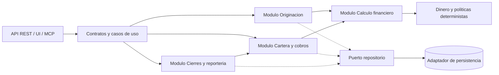
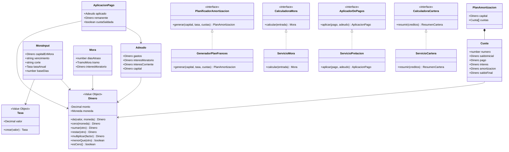
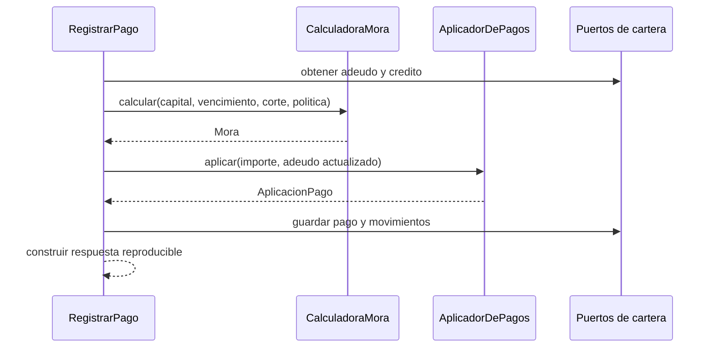
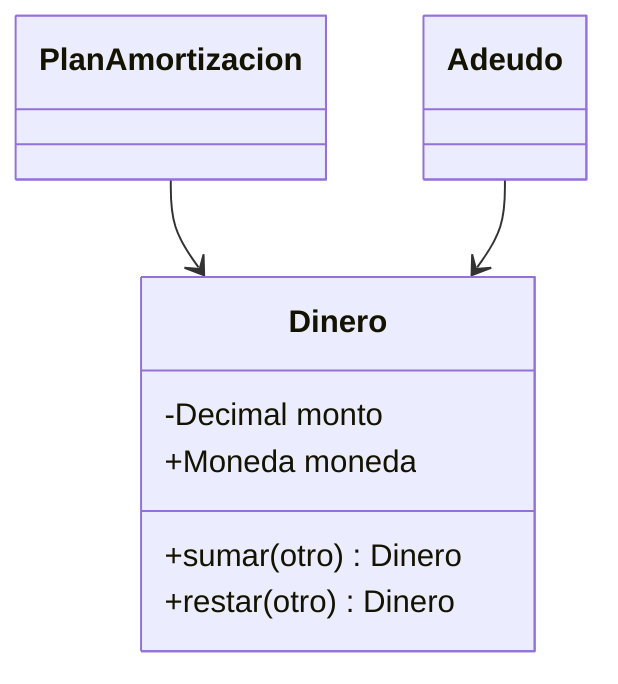
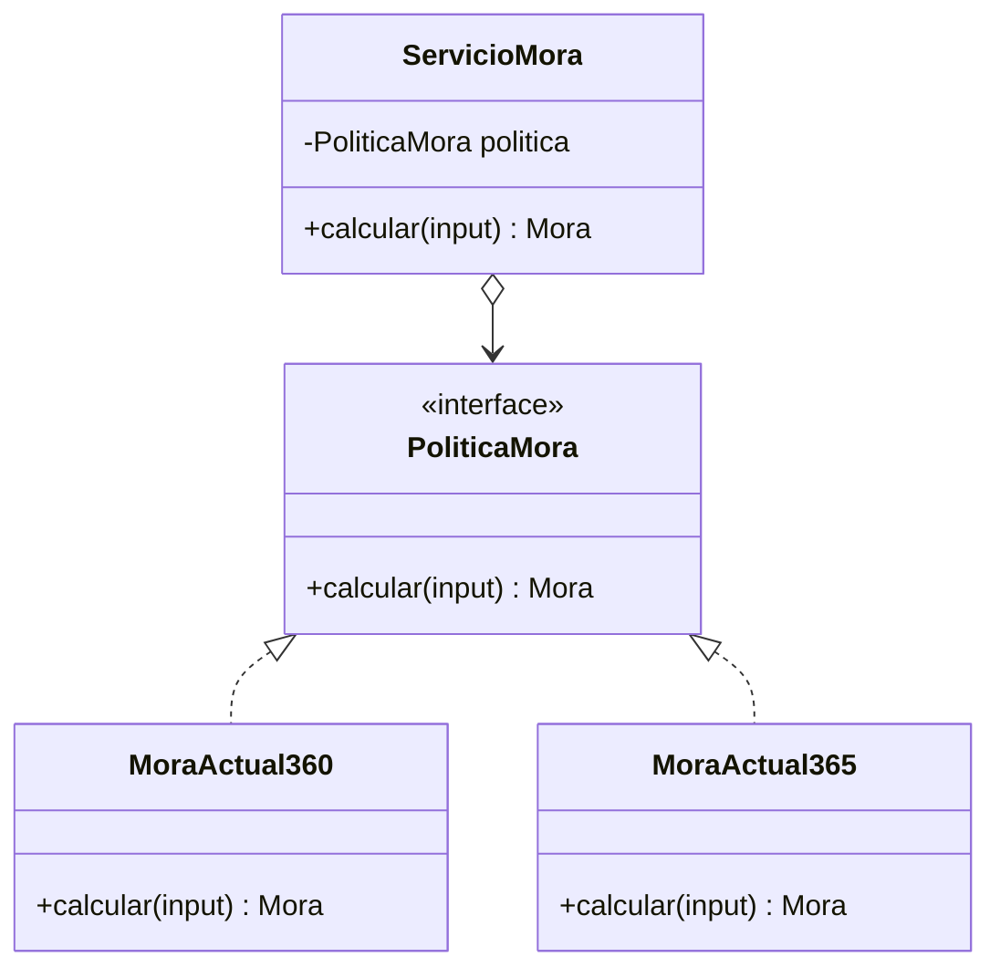
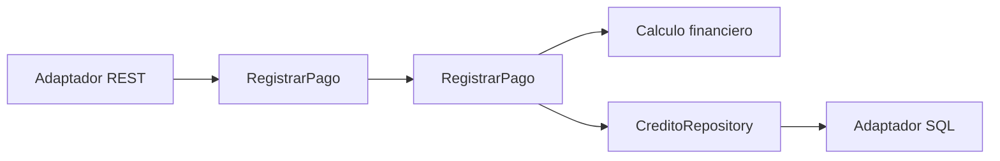
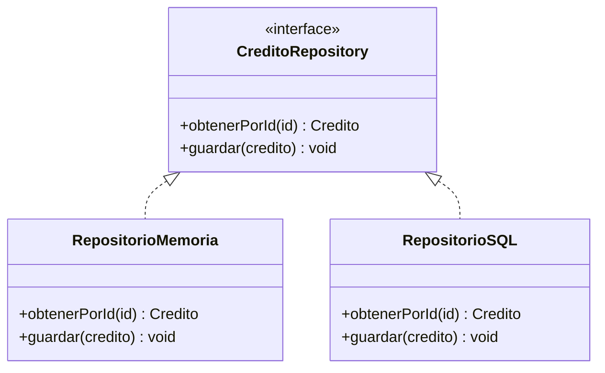
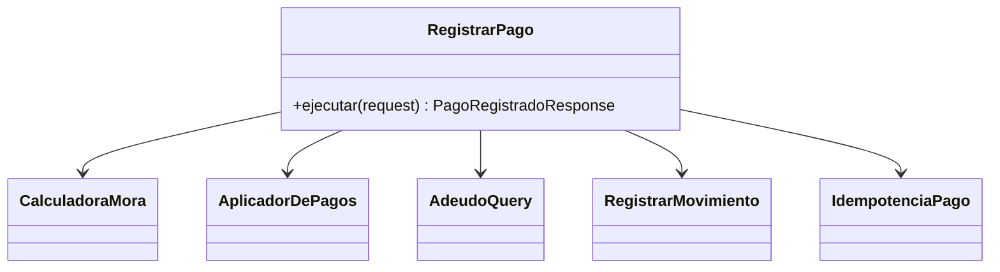

# E3 - Diseno de componentes y principios

## 1. Alcance y decisiones

Este documento traduce el modelo conceptual y la arquitectura hexagonal del SGMC a modulos, interfaces y clases. El sistema se despliega inicialmente como un monolito modular: cada modulo tiene una responsabilidad clara, pero no se introduce consistencia distribuida innecesaria.

El nucleo ejecutable actual es el modulo **Calculo financiero** (`src/dominio`). Originacion, persistencia, cierres completos y recuperacion se describen como contratos de diseno futuro; no se presentan como funcionalidades implementadas en E4.

### Reglas de dependencia

- Los modulos de dominio no dependen de HTTP, Zod, una base de datos, un framework ni el reloj del sistema.
- Los adaptadores dependen de puertos; el dominio no depende de adaptadores.
- Los importes cruzan el dominio como `Dinero`, nunca como `number`.
- Las fechas de calculo, tasas y base de dias son datos explicitos de la operacion.
- Los modulos se comunican mediante interfaces y DTOs de caso de uso, no importando estructuras internas de otro modulo.



## 2. Descomposicion modular (seccion 7.2)

### 2.1 Contratos y casos de uso

**Responsabilidad unica:** validar entradas externas, mapear DTOs y coordinar una operacion de aplicacion. No calcula intereses ni decide reglas financieras.

**Interfaces principales:**

```ts
interface RegistrarPago {
  ejecutar(entrada: RegistrarPagoRequest): Promise<PagoRegistradoResponse>;
}

interface GenerarCierre {
  ejecutar(entrada: GenerarCierreRequest): Promise<CierreResponse>;
}

interface ConsultarCarteraEnRiesgo {
  ejecutar(entrada: ConsultarCarteraRequest): Promise<ResumenCarteraResponse>;
}
```

`RegistrarPago` recibe `creditoId`, importe, fecha de pago, medio y clave de idempotencia. `GenerarCierre` recibe periodo y fecha de corte. Los esquemas Zod de `src/contratos` son el borde de entrada y salida; las reglas permanecen en los modulos de dominio.

### 2.2 Originacion

**Responsabilidad unica:** administrar cliente, solicitud, evaluacion, aprobacion, desembolso y la transicion inicial del credito.

**Interfaces:**

```ts
interface SolicitarCredito {
  ejecutar(entrada: SolicitarCreditoRequest): Promise<SolicitudCreditoResponse>;
}

interface EvaluarCredito {
  evaluar(solicitud: SolicitudCredito): ResultadoEvaluacion;
}

interface DesembolsarCredito {
  ejecutar(entrada: DesembolsarCreditoRequest): Promise<CreditoResponse>;
}

interface CreditoRepository {
  obtenerPorId(id: string): Promise<Credito>;
  guardar(credito: Credito): Promise<void>;
}
```

Originacion puede invocar a `PlanificadorAmortizacion` del modulo financiero, pero no conoce `Decimal.js` ni las reglas internas de redondeo.

### 2.3 Calculo financiero

**Responsabilidad unica:** producir resultados financieros deterministas: dinero, plan de amortizacion, mora y operaciones de prelacion. Es el modulo con mayor exigencia de exactitud y el walking skeleton de E4.

**Interfaces publicas:**

```ts
interface PlanificadorAmortizacion {
  generar(capital: Dinero, tasaMensual: Tasa, cuotas: number): PlanAmortizacion;
}

interface CalculadoraMora {
  calcular(entrada: MoraInput): Mora;
}

interface AplicadorDePagos {
  aplicar(pago: Dinero, adeudo: Adeudo): AplicacionPago;
}

interface CalculadoraCartera {
  resumir(creditos: readonly CreditoCartera[]): ResumenCartera;
}
```

Implementacion E4: `generarPlanFrances`, `calcularMora`, `aplicarPago` y `resumirCartera` son funciones puras compatibles con estas interfaces; `Dinero` es el objeto de valor compartido del modulo.

### 2.4 Cartera y cobros

**Responsabilidad unica:** registrar pagos, obtener el adeudo vigente, aplicar la prelacion, emitir movimientos y derivar el estado posterior al pago.

**Interfaces:**

```ts
interface AdeudoQuery {
  obtener(creditoId: string, cuota: number, fechaCorte: string): Promise<Adeudo>;
}

interface RegistrarMovimiento {
  registrar(movimiento: Movimiento): Promise<void>;
}

interface IdempotenciaPago {
  buscar(clave: string): Promise<PagoRegistradoResponse | null>;
  guardar(clave: string, respuesta: PagoRegistradoResponse): Promise<void>;
}
```

Este modulo usa `CalculadoraMora` y `AplicadorDePagos` por puerto. No duplica sus formulas.

### 2.5 Cierres y reporteria

**Responsabilidad unica:** consolidar un periodo, calcular indicadores, congelar resultados y consultar cartera en riesgo.

**Interfaces:**

```ts
interface CierreMensual {
  generar(periodo: string, fechaCorte: string): Promise<Cierre>;
}

interface CierreRepository {
  buscarPorPeriodo(periodo: string): Promise<Cierre | null>;
  guardar(cierre: Cierre): Promise<void>;
}

interface RecuperarIncobrable {
  registrar(entrada: RecuperacionRequest): Promise<RecuperacionResponse>;
}
```

El cierre consulta datos mediante puertos y llama a `CalculadoraCartera`; no accede directamente a tablas ni recalcula saldos.

## 3. Diseno detallado del modulo Calculo financiero

### 3.1 Clases, objetos de valor y servicios



### 3.2 Invariantes por clase

| Elemento | Invariantes y comportamiento |
| --- | --- |
| `Dinero` | Es inmutable; redondea a 2 decimales `ROUND_HALF_UP`; rechaza importes no finitos y operaciones entre monedas distintas. |
| `Tasa` | Representa una tasa no negativa y evita que una tasa sin unidad llegue al calculo. |
| `GeneradorPlanFrances` | Valida cuotas positivas; calcula interes sobre saldo inicial; ajusta la ultima amortizacion para que el saldo final sea `0.00`. |
| `ServicioMora` | Calcula dias con las fechas recibidas; usa solo capital en mora; clasifica el tramo y aplica tasa/base parametrizadas. |
| `ServicioPrelacion` | Consume en orden gastos, interes moratorio, interes corriente y capital; devuelve remanente sin mutar el adeudo. |
| `ServicioCartera` | Excluye estados incobrable/cancelado de cartera activa; considera reestructurado o mas de 30 dias como riesgo. |
| `Cuota` | Conserva la trazabilidad de saldo inicial, interes, amortizacion, pago y saldo final. |
| `PlanAmortizacion` | Contiene cuotas ordenadas y la suma de amortizaciones coincide con el capital. |

### 3.3 Flujo de pago



## 4. Aplicacion explicita de SOLID

| Principio | Aplicacion concreta | Razon de diseno |
| --- | --- | --- |
| **S - Responsabilidad unica** | `Dinero` maneja operaciones monetarias; `ServicioMora` calcula mora; `ServicioPrelacion` distribuye pagos; `ServicioCartera` resume riesgo. | Un cambio en redondeo no modifica mora ni cartera; cada regla tiene una prueba y una causa de cambio identificable. |
| **O - Abierto/cerrado** | `CalculadoraMora` recibe una politica de mora y `PlanificadorAmortizacion` abstrae la formula. | Se pueden agregar politica Actual/365 o plan aleman implementando una estrategia, sin alterar los consumidores. |
| **L - Sustitucion de Liskov** | Cualquier implementacion de `PlanificadorAmortizacion` devuelve un `PlanAmortizacion` valido; cualquier `AplicadorDePagos` conserva prelacion e invariantes del contrato. | Los casos de uso no dependen de una formula concreta ni deben conocer condiciones especiales de una implementacion. |
| **I - Segregacion de interfaces** | `CreditoRepository`, `AdeudoQuery`, `CierreRepository` y `IdempotenciaPago` son puertos pequenos, separados por cliente. | Un adaptador de prueba no tiene que implementar persistencia de cierres para probar pagos. |
| **D - Inversion de dependencias** | Originacion, cobros y cierres dependen de `PlanificadorAmortizacion`, `CalculadoraMora` y repositorios, no de `decimal.js`, SQL o HTTP. | Las reglas se prueban aisladas y la infraestructura puede sustituirse sin cambiar el dominio. |

## 5. Aplicacion explicita de GRASP

| Principio | Donde se aplica | Por que |
| --- | --- | --- |
| **Information Expert** | `Dinero` valida moneda y ejecuta suma/resta; `ServicioCartera` conoce la clasificacion de riesgo; `ServicioPrelacion` conoce el orden de rubros. | La responsabilidad se asigna al objeto que posee los datos y la regla, reduciendo getters y logica dispersa. |
| **Controller** | `RegistrarPago`, `GenerarCierre` y `SolicitarCredito` reciben comandos de los adaptadores. | Un unico punto coordina cada caso de uso y evita que un controlador HTTP conozca el dominio interno. |
| **Creator** | `GeneradorPlanFrances` crea `PlanAmortizacion` y sus `Cuota`; `ServicioPrelacion` crea `AplicacionPago`. | El creador tiene los datos necesarios y mantiene los invariantes al construir resultados. |
| **Low Coupling** | Se usan DTOs, puertos y `Dinero`; los modulos no comparten repositorios concretos. | Un cambio en API o persistencia no propaga dependencias hacia el calculo. |
| **High Cohesion** | El modulo financiero contiene exclusivamente politicas y resultados financieros; cierres coordina consolidacion, no formulas de dinero. | Cada modulo mantiene un foco estrecho y es mas facil de entender, probar y reemplazar. |
| **Polymorphism** | Politicas de amortizacion, mora y destino de excedente se modelan mediante interfaces/estrategias. | Las variaciones de negocio se resuelven por implementacion, no por grandes condicionales en los casos de uso. |
| **Pure Fabrication** | `CreditoRepository`, `IdempotenciaPago` y `CierreRepository` son servicios de soporte. | Se encapsulan responsabilidades tecnicas sin sobrecargar entidades del dominio con SQL, cache o control de duplicados. |
| **Indirection** | Los puertos median entre casos de uso y adaptadores de persistencia o mensajeria. | La intermediacion permite cambiar infraestructura y facilita dobles de prueba. |
| **Protected Variations** | `CalculadoraMora` protege al sistema de cambios en calendario, tasa y base de dias; `Dinero` protege de cambios de precision decimal. | Los puntos de variacion quedan encerrados detras de contratos estables. |

## 6. Patrones aplicados (seccion 9)

### 6.1 Object Value / Value Object (patron de dominio)

`Dinero` encapsula monto y moneda, es inmutable y define operaciones con semantica financiera. Evita que `number` y reglas de redondeo se filtren por los modulos.



### 6.2 Strategy (GoF)

Las politicas variables se expresan como estrategias intercambiables. El caso de uso depende de la interfaz y no de una formula fija.



La implementacion actual recibe `baseDias` como parametro; la interfaz hace explicita la extension futura sin duplicar el caso de uso.

### 6.3 Adapter (GoF)

Los adaptadores convierten el contrato externo a tipos de dominio y viceversa. El dominio no conoce HTTP, Zod ni una base de datos.



El adaptador REST transforma JSON a `Dinero`; el adaptador SQL transforma filas a entidades. Ambos pueden reemplazarse sin alterar `Caso`.

### 6.4 Repository (patron de acceso a datos)

Los puertos `CreditoRepository`, `CierreRepository` e `IdempotenciaPago` abstraen colecciones persistentes. Un repositorio en memoria sirve para pruebas y uno SQL para produccion.



### 6.5 Facade (GoF)

`RegistrarPago` actua como fachada del flujo de cobros: coordina consulta de adeudo, mora, prelacion, movimientos e idempotencia y expone una operacion simple al adaptador.



La fachada no contiene formulas: solo coordina y aplica las transacciones y validaciones de caso de uso.

## 7. Cohesion y acoplamiento por modulo

Escala: **alta**, **media** y **baja**. El objetivo es alta cohesion interna y bajo acoplamiento externo.

| Modulo | Cohesion | Acoplamiento | Dependencias permitidas | Riesgo y control |
| --- | --- | --- | --- | --- |
| Contratos y casos de uso | Alta: cada handler coordina un caso de uso | Bajo: depende de puertos y mapeadores | DTOs, validadores y puertos | Evitar formulas en handlers; pruebas de contrato y orquestacion. |
| Originacion | Alta: ciclo de solicitud a desembolso | Medio-bajo: usa repositorio y planificador | Contratos propios, `PlanificadorAmortizacion`, `CreditoRepository` | No importar clases concretas de persistencia ni `Decimal`. |
| Calculo financiero | Muy alta: reglas deterministas de dinero y calculo | Bajo: `decimal.js` encapsulado y tipos propios | `Dinero`, `date-fns`, `decimal.js` | Es modulo compartido; mantener API pequena y pruebas de invariantes. |
| Cartera y cobros | Alta: adeudo, pago, prelacion y movimientos | Medio: consulta credito, mora, repositorios e idempotencia | Puertos de cartera y calculo financiero | Evitar que estados o SQL se filtren a las formulas. |
| Cierres y reporteria | Alta: consolidacion e indicadores | Medio: consulta cartera, calculo y repositorio de cierres | `CalculadoraCartera`, `CreditoQuery`, `CierreRepository` | Cierre idempotente por periodo; no recalcular reglas de pago. |
| Adaptadores de infraestructura | Alta por tecnologia: HTTP, SQL, archivos, mensajeria | Alto hacia frameworks externos, bajo hacia dominio | Implementaciones de puertos | Aislar mapeo, errores y transacciones en el borde. |

### Matriz resumida de dependencias

| Desde / hacia | Contratos | Originacion | Calculo | Cartera | Cierres | Infraestructura |
| --- | ---: | ---: | ---: | ---: | ---: | ---: |
| Contratos | - | X | 0 | X | X | 0 |
| Originacion | 0 | - | X | 0 | 0 | 0 |
| Calculo | 0 | 0 | - | 0 | 0 | 0 |
| Cartera | 0 | 0 | X | - | 0 | 0 |
| Cierres | 0 | 0 | X | X | - | 0 |
| Infraestructura | X | X | 0 | X | X | - |

`X` representa una dependencia directa por interfaz publica; `0` indica que no debe existir importacion directa. Infraestructura implementa puertos definidos por aplicacion/dominio, por lo que la flecha de compilacion puede apuntar hacia el interior aunque en ejecucion reciba llamadas desde los casos de uso.

## 8. Trazabilidad y evidencia

| Decision de E3 | Evidencia en el repositorio |
| --- | --- |
| Modulo financiero puro | `src/dominio/dinero.ts`, `plan-amortizacion.ts`, `calculadora-mora.ts`, `prelacion-pago.ts`, `cartera.ts` |
| Contratos en el borde | `src/contratos/comunes.ts`, `pagos.ts`, `cartera.ts` |
| Dinero como objeto de valor | ADR-002 y pruebas de operaciones monetarias |
| Hexagonal como monolito modular | ADR-001 y `docs/diagramas/06-c4-arquitectura.md` |
| Prelacion, mora y cartera | `tests/prelacion-pago.test.ts`, `calculadora-mora.test.ts`, `cartera.test.ts` |
| Plan frances | `tests/plan-amortizacion.test.ts` |

La implementacion futura debe conservar estos contratos y agregar pruebas de adaptadores, idempotencia, transiciones de `Credito` y cierres congelados antes de declarar completo el alcance conceptual de originacion y persistencia.
