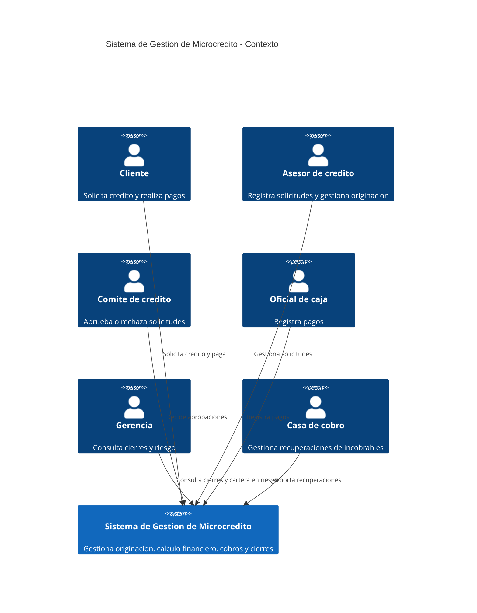
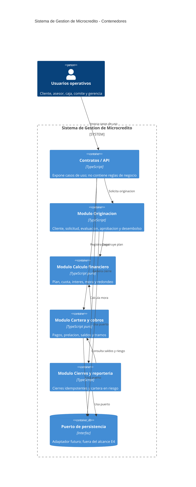

# Arquitectura C4

## Contexto

## Contenedores logicos

La arquitectura es un monolito modular con frontera hexagonal: el dominio no depende de HTTP, base de datos ni reloj del sistema. El walking skeleton actual es `calculo` y las funciones de `src/dominio`.
